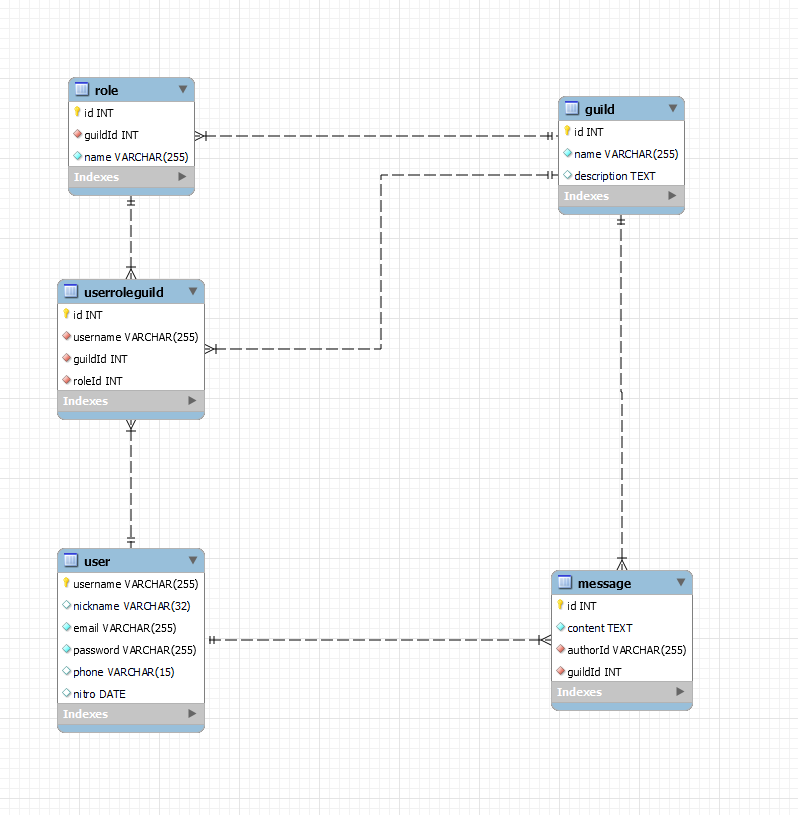

# Projet API RESTFUL - Discord

## Dépendances

- Express
- JSON Web Tokens
- MySQL 2
- Sequelize

## Les cinqs entités :

- Guild
  - **id**
  - name
  - description
- Role
  - **id**
  - guildId _(foreign key de Guild)_
  - name
- User
  - **username**
  - nickname
  - email
  - password _(hashé avec bcrypt)_
  - phone
  - nitro _(date d'expiration)_
- Message
  - **id**
  - content
  - authorId _(foreign key de User)_
  - guildId _(foreign key de Guild)_
- UserRoleGuild
  - **id**
  - username _(foreign key de User)_
  - guildId _(foreign key de Guild)_
  - roleId _(foreign key de Role)_



## Cahier des charges

### Créer une API RESTFULL sur un projet libre

#### Critères:

- [x] Avoir au moins 3 entités en plus de l'entité(Model) User
- [ ] Mettre en place l'authentification JWT
- [x] Utilisation de Sequelize pour la partie BDD
- [ ] Avoir une gestion de droits (unitaire/rôle ou les deux)
- [x] Avoir une bonne hiérarchie de projet
- [ ] Avoir une bonne architecture logicielle
- [ ] Respecter la norme RESTFULL

## Collaborateurs

- Charles-Henry Clerc ([Charlo75clc](https://github.com/Carlos75clc))
- Jonas Barth ([Daiki4529](https://github.com/Daiki4529))

> [!NOTE]
>
> ## Pour lancer le serveur
>
> ```cmd
> npm run start
> ```
